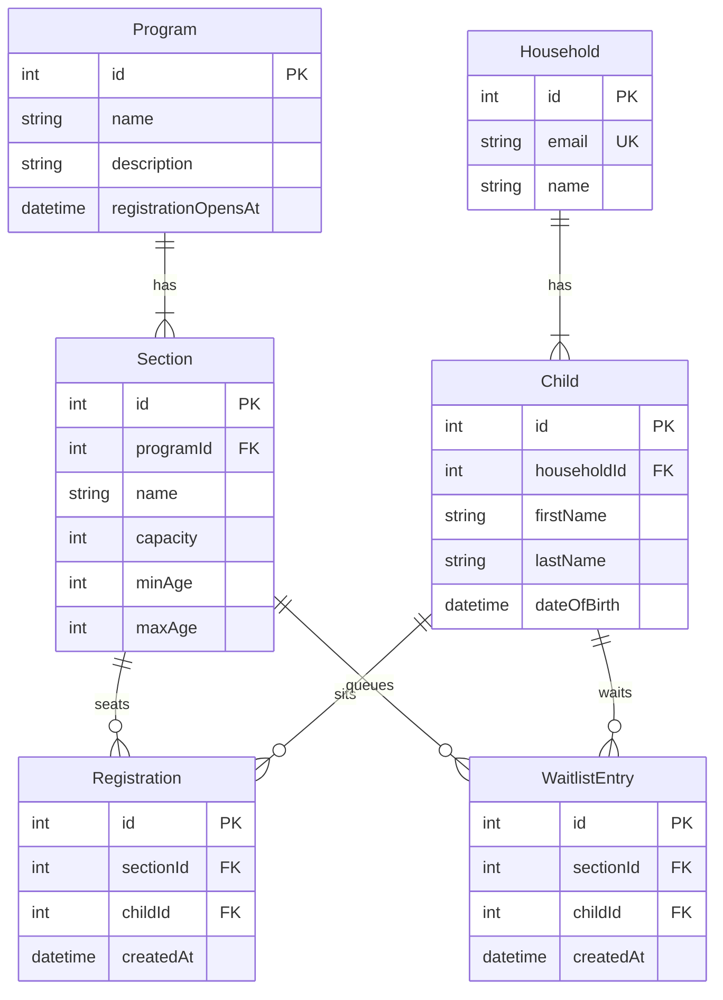

# Rec Take Home

Parks & recreation registration. City staff use **admin**; families use **web**. Shared domain logic and SQLite live in `packages/data`.

## What I built and why

I treated this as a data-modeling exercise, not a full product. The interesting problems are capacity, waitlists, age gates, and a registration open time — so I put the schema and the actions next to the database, then proved them with tests.

**Monorepo.** I started by scaffolding a Bun workspace in Cursor and initializing the repo (the assignment is in `ASSIGNMENT.md`). After some Notion time thinking through the shape, I rejected Bun and switched to Turborepo + pnpm. Prisma — especially Studio and `better-sqlite3` — did not play well with Bun. I still wanted a monorepo: two audiences (staff vs families) sharing one data layer, without a shared HTTP API yet. Apps import functions from `@rec/data`.

**Prisma + SQLite.** I chose Prisma because typed ORM definitions are the point of this exercise. SQLite keeps the assignment local; no Postgres to stand up.




**Isolated tests.** Before domain logic, I set up a basic test harness: each Vitest run gets its own SQLite file, migrations apply, then the file is torn down. Domain tests reset tables between cases.

**Domain actions, not events.** The two actions parents actually take are register and drop. Those are the ones I built tests around:

- `registerChild` — child and section must exist; program must be open (`registrationOpensAt` null or in the past); age must fit; no double-enroll. If a seat is open they sit; otherwise they waitlist.
- `dropFromSection` — a seated drop promotes the first waitlisted child (FIFO by `createdAt`, then `id`). A waitlisted drop just leaves.

I was getting ahead of myself and wanted Inngest events for this. Cursor recommended I keep seating as a transactional function next to the database, easy to test. Side effects (email, charge) can hang off a successful write later.

A large chunk of the time was reading the test cases and making sure what the agent wrote actually matched the rules I wanted.

**Thin UI at the end.** `listOpenSections` is the public catalog: open programs only, with remaining seats and waitlist counts. Admin can ask for the roster. Seed data has an open swim section with seats, a full clay studio with a waitlist, and basketball that is still closed. Web can register the seeded child Avery Chen through a server action; admin shows who is seated and who is waiting. That was enough to show the shared DB and a couple of the test cases in the browser.

## What I deferred

- **Auth and a real household session.** The web button registers Avery from seed. Fine for a two-hour slice; not a product.
- **Admin CRUD.** Staff cannot create programs or flip `registrationOpensAt` in the UI. Opening is a date on the row.
- **Sibling discount and any money.** No prices, invoices, or charges.
- **Household batch register.** Parents often enroll two kids at once; I did not wrap that in one transaction.
- **Inngest / async workflows.** Seating stays in the Prisma transaction. Events later, if we need email or billing after the write.
- **A shared HTTP API.** Both Next apps call `@rec/data` directly. An API would matter if a third client showed up.

## What I would push back on

- **Multi-child registration in a single transaction.** A household of three hitting a section with one seat should not be all-or-nothing by default. Register each child; one sits, the others waitlist. A batch wrapper can come later if staff really want atomic "all kids or none."
- **Automatic charging when someone comes off the waitlist.** Promotion is a seating problem. Charging is billing, retries, failed cards, and "we never agreed to pay." Auto-promote the seat; tell billing separately.
- **Pricing and transactions in this slice.** I did not add prices. Sibling discounts need a price first, and they change the registration write into a commerce flow I would not rush.
- **Fairness beyond FIFO.** I do not want to own "who deserves the seat." FIFO is acceptable to start. Weighted systems (siblings already in, residents vs non-residents, time on list vs need) are policy. Encode them when the department can say the rule out loud.

## What I would do next

- Household login and a child picker instead of a seeded Avery button.
- Staff UI to create sections and set `registrationOpensAt`.
- After seating is trusted, emit events for email / charge — do not put those inside the transaction.
- Postgres if this left the laptop.

## Tools & Process

I used **Cursor** almost the whole time, mostly in the agent window with the file tree on the right. I spent some time in **Notion** first, dictating and thinking through the plan (monorepo, Prisma, register/drop as the core) before asking the agent to build.

The hard part was reigning in the AI. It got ahead of me. It created the full data model without me asking. I did not want to go backwards once the schema existed, but I did keep pulling it back: no Inngest until the writes were testable. I read the generated tests line by line and only kept going when they matched the rules I meant.

## Start locally

```bash
pnpm install
pnpm db:migrate
pnpm seed
pnpm dev
```

| App | Audience | URL |
| --- | --- | --- |
| web | Families | http://localhost:3000 |
| admin | City staff | http://localhost:3001 |

```bash
pnpm test        # data-layer tests against an isolated SQLite file
pnpm db:studio   # Prisma Studio on port 5555
pnpm seed        # reset local data (open swim, full clay, closed basketball)
```

Requires Node.js 22+ and pnpm 10. SQLite is `packages/data/rec.db`.

## Structure

```text
apps/admin          Staff catalog + roster
apps/web            Family catalog + register Avery
packages/data       Prisma schema, domain actions, seed, tests
```
